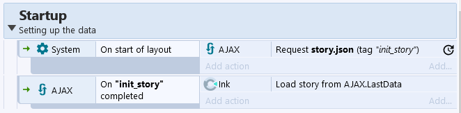

- [Ink for Construct](#ink-for-construct)
- [Loading a story](#loading-a-story)
- [Loading and saving state](#loading-and-saving-state)
- [Telling the story](#telling-the-story)
  - [Advancing the story](#advancing-the-story)
  - [Getting the text](#getting-the-text)
  - [Dealing with choices](#dealing-with-choices)
  - [Using tags](#using-tags)
    - [Browsing through all the tags](#browsing-through-all-the-tags)
    - [Checking for a specific tag](#checking-for-a-specific-tag)
      - [Key-value tags](#key-value-tags)
  - [Ink variables](#ink-variables)
- [Advanced usage](#advanced-usage)

# Ink for Construct

This [Construct 3](https://www.construct.net/en) plugin helps you
integrate [ink](https://www.inklestudios.com/ink/) stories within
a Construct 3 game.

Follow [instructions](https://www.construct.net/en/make-games/manuals/construct-3/tips-and-guides/installing-third-party-addons)
on the Construct website to install and enable.

The rest of this document explains how to use the plugin within the 
construct editor.
To learn how to use ink as a language, refer to its 
[own tutorial](https://github.com/inkle/ink/blob/master/Documentation/WritingWithInk.md).

# Loading a story

Most times you will want to load a story from a compiled json story file.
This means compiling your story with inky or inklecate in any way you can,
and then uploading your json file to your Construct 3 project.

Request the file with the built-in [AJAX]() plugin, then use the `Load story`
action with its response.

Tada, you've loaded an ink story into your game!

# Loading and saving state

Ink manages its own state with its own variables, and story progression.

When saving your game, you should also save the story state to know
where to pick up from.

This is done with the `StateToJson` expression, which returns a string
containing the JSON representation of the state, which can then be
written to a file.

When loading your game save, the JSON representation of the story state
can be loaded back into ink with `LoadState`.

# Telling the story

## Advancing the story

Telling a story with Ink within Construct is done in two steps:
1. Advancing the story
2. Observing the new state of the story

That means first using the `Continue` action to make the story go forward
if you can, and then using the various expressions to get the
text, choices, or tags.

A `CanContinue` condition is available as well,
to check whether the story can continue or not.

## Getting the text

To get the text built during the last `Continue` action,
use the `LastText` expression.

The actual displaying of text on the screen is up to you,
using whatever means you'd want to use within Construct.

## Dealing with choices

When `CanContinue` return false, it's highly likely that it means
the story hit a branching point where choices are available.

There is a `For all choices` loop available for you to iterate
over all available choices, if you want to display buttons to choose them
or do something else for each of them.

For each choice during the loop, you can use `LoopChoiceText` to get the
text meant to represent that choice.

In order to pick that choice, you can use the `Choose` action, 
and give it `LoopChoiceIndex`. That can be part of a button's `onclick` event
or at any other moment. `LoopChoiceIndex` gives you the choice's index
and `Choose` picks the choice with the given index.

You can always check whether choices are present with the `ChoicesAmount`
expression.

## Using tags

Ink lets you use tags to associate some textual metadata with bits of story.
To examine those from Construct, you can use two approaches:

### Browsing through all the tags

The loop `ForEachTag` helps you process every available tag in an
unspecified order, to give you the most freedom of observation.

Inside the loop, `LoopTagText` will give you the text of the tag
looped over at the time.

### Checking for a specific tag

If you want to know whether the tag `#blue` is present or not,
you can use the `CheckTags` condition. Simple, straightforward.

Another more involved way to look at the tags knowing what you're looking for,
is to try to get a "value" from a "key-value" tag.

#### Key-value tags

Those are not an Ink feature at all, they're just an unnamed
conventional use of Ink tags.

The idea is that your ink tags can have any text in them except a `#` sign,
so they can also have spaces and punctuation.
Meaning you can have tags that look like `#character : Bob` or `#emote-sad`,
and those can be extremely useful as actual metadata about
a line of dialog or a bit of story.

This plugin provides a way to get the value of such a tag.
`KeyValueTag("character",":")` will return `"Bob"` in the example given above,
and `KeyValueTag("emote","-")` will return `"sad"`.

If the "key" is not found (meaning there's no tag that begin with
the given key parameter) then the returned value is falsy and not text.

The intended use of this expression is to store the value in a variable
and then check that it's defined with the System `Evaluate Expression`
condition before doing what you need with it.

## Ink variables

If your story has a bit of logic and dynamism, it's very likely you'll have
variables evolving in your ink machine.
If you ever want to get their value from Construct,
you can use `VariableValue`.

If you want to *set* their value from Construct, you can use
the `Set Variable` action.

There's also a possibility to react instantly to changes in ink variables,
with the `Start Watchinb Variable` action and `VariableChanged` condition.

**Note** that this only works for numbers and strings, as
those are the types of values Construct knows how to manage.
To deal with Ink lists, you'll have to go through javascript scripting.
See the [Advanced usage](#advanced-usage) section.

# Advanced usage

Anything you can't do with the actions, expressions, and conditions,
you can most likely do with script.

There's two API endpoints this plugin defines:
- a way to load a story from a json string: `Ink.loadStory(...)`
- access to the story: `Ink.story`

The story itself, once accessed, has the same interface as described by
[inkjs](https://github.com/y-lohse/inkjs).